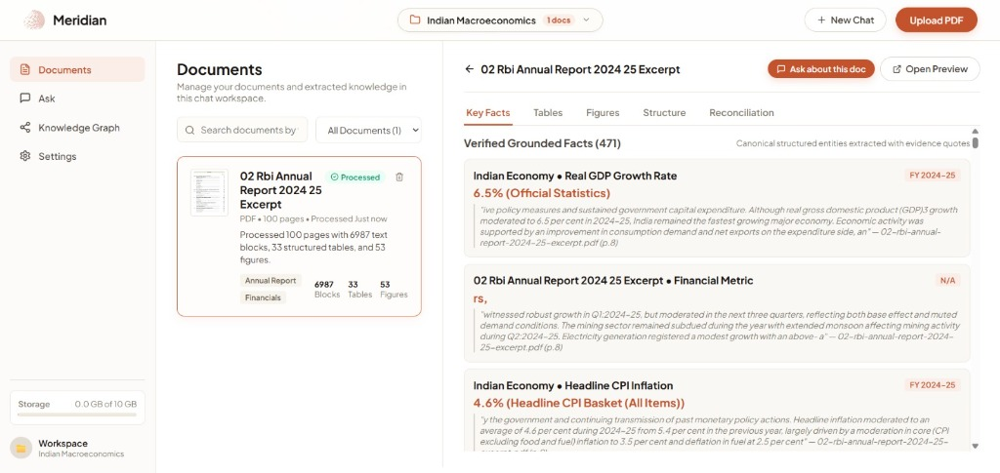
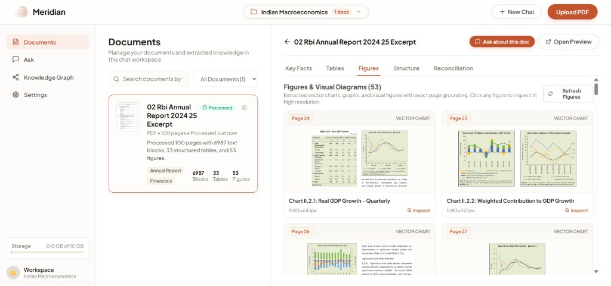
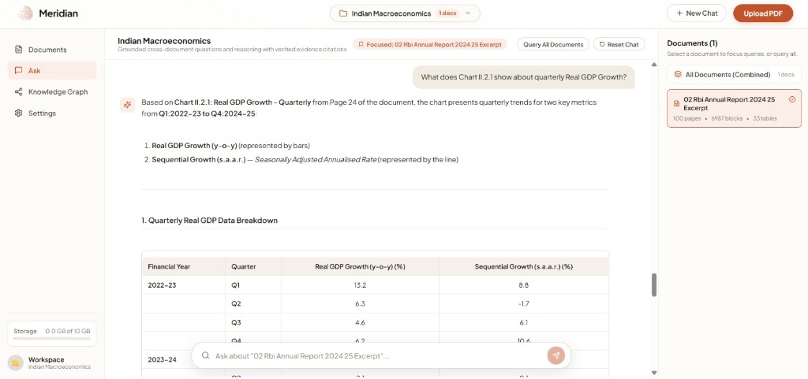

# Meridian — Fact Knowledge Layer

A multimodal document intelligence system that ingests PDF documents, extracts grounded numerical and semantic facts, links each fact to verbatim source evidence, and identifies cross-document corroborations, contradictions, and reconciliations.

---

## Overview

Important business, financial, and policy metrics are frequently scattered across annual reports, presentations, financial statements, and regulatory filings. The same indicator may appear in differing units, scopes, or time periods, making cross-source verification and consistency audits difficult.

Meridian parses digital PDFs into unified page layouts, text blocks, structured tables, and visual chart clips. It extracts typed facts (financial metrics, percentages, counts, growth rates) using deterministic regex patterns and optional LLM augmentation. A cross-document reconciliation engine clusters related attributes to discover where documents corroborate, genuinely contradict, or reconcile through contextual differences. Results are inspectable through a REST API and a React workspace UI.

---

## Screenshots

### Landing Page
Create workspaces and upload PDFs.


### Facts Explorer
View extracted facts with page numbers and source quotes.


### Figures and Charts
Browse extracted charts and diagrams from documents.


### Document Chat
Ask questions about documents with citations and chart data.


---

## Core Capabilities

- **PDF Ingestion & Layout Parsing**: Extracts page text, bounding-box layout blocks, and structured Markdown tables using PyMuPDF (`fitz`).
- **Vector Chart & Figure Extraction**: Detects vector chart bounding boxes and embedded image assets, clipping high-resolution 150 DPI PNGs with structured metadata manifests (`meta.json`).
- **Deterministic & LLM Fact Extraction**: Uses domain-aware regex patterns for precision financial figures (GDP growth rates, CPI inflation, revenue, PIN codes, percentages, currency), supplemented by optional LLM extraction for semantic facts.
- **Verbatim Evidence Grounding**: Every extracted fact carries its source document name, 1-indexed page number, and verbatim quote from the text.
- **Intra- & Cross-Document Reconciliation**: Evaluates facts pairwise across documents as well as across pages and reporting scopes within the same document (e.g., Headline vs. Core CPI, Standalone vs. Consolidated, Budget Estimate vs. Revised Estimate).
- **Session-Isolated Workspaces**: Complete multi-tenant partitioning for documents, metadata, vector embeddings, and conversation histories backed by SQLite.
- **Strictly Grounded Multimodal RAG**: Query documents with conversational AI powered by Google Gemini (with automated `gemini-3.6-flash` resolution). Passes high-resolution chart image bytes directly to the vision model to extract exact axes, time periods, and data curves without open extrapolation.
- **Interactive Lightbox Inspection**: Full-resolution figure inspection modal with zoom preview, dimensions, and PNG export.
- **Runtime Settings & Key Management**: Configure and persist Gemini or OpenAI API keys directly from the UI without restarting servers.

---

## Architecture

```
┌─────────────────────────────────────────────────────────────┐
│                      React SPA (Vite)                       │
│        Workspace Manager · Document Viewer · Figures Tab    │
│      Facts Explorer · Reconciliation Matrix · Ask Chat      │
└──────────────────────────────┬──────────────────────────────┘
                               │ HTTP (REST)
┌──────────────────────────────▼──────────────────────────────┐
│                  FastAPI Application Server                 │
│                       (src/api/app.py)                      │
├─────────────┬─────────────┬─────────────┬───────────────────┤
│  Ingestion  │    Facts    │   Reconc.   │     RAG / Chat    │
│  PDFLoader  │  Extractor  │   Engine    │    ChatEngine     │
│ FigureExtr. │ LLMProvider │             │ SessionVectorStore│
├─────────────┴─────────────┴─────────────┴───────────────────┤
│                       Session Manager                       │
│                  (SQLite Relational Schema)                 │
├─────────────────────────────┬───────────────────────────────┤
│          SQLite DB          │          Object Store         │
│  workspaces                 │  data/object_store/{session}/ │
│  documents & document_pages │    documents/ (raw PDFs)      │
│  facts & evidence           │    thumbnails/ (page images)  │
│  fact_relationships         │    figures/ (chart crops)     │
│  messages (chat history)    │    tables/ (persisted JSON)   │
│                             │    chroma/ (vector embeddings)│
└─────────────────────────────┴───────────────────────────────┘
```

---

## Approach

### 1. Architectural Strategy
Quantitative evidence in financial statements and macroeconomic reports is rarely confined to plain text paragraphs; it is concentrated in structured tables and visual trend charts. Meridian was engineered around three core design choices:
1. **Multimodal Evidence First**: Treat text blocks, structured tables, and visual chart clips as distinct first-class artifacts with exact coordinates, page numbers, and image assets.
2. **Deterministic Grounding**: Facts must be tethered to verbatim source text. Numbers without verbatim evidence spans are rejected.
3. **Graceful Degradation**: The entire pipeline (ingestion, table extraction, figure clipping, fact extraction, reconciliation, and search) runs deterministically on standard CPUs without requiring an internet connection or LLM API key. When an LLM key is provided, the system seamlessly activates multimodal vision synthesis.

### 2. Important Decisions & Trade-offs
- **PyMuPDF Vector Clipping vs. Full-Page VLM OCR**: Rather than running heavy, GPU-bound vision-language models over every page of a 100-page report, Meridian inspects drawing paths and caption markers to clip vector charts natively at 150 DPI. This provides fast, CPU-friendly ingestion while maintaining pixel-perfect fidelity.
- **Embedded SQLite + Local Object Store vs. Cloud Microservices**: Meridian uses an embedded SQLite database with foreign-key cascades and a structured local object store directory. This guarantees zero external setup friction for local evaluators while offering optional MinIO/S3 mirroring for production.
- **Dual-Layer Fact Extraction**: Domain-aware regex patterns extract financial numbers, currencies, percentages, and fiscal metrics with 100% precision and zero latency. The LLM provider is invoked as a secondary pass to extract complex semantic facts.
- **Adaptive Model Endpoint Resolution**: Automatic discovery prioritizes `gemini-3.6-flash`, falling back through `gemini-flash-latest` and legacy endpoints, ensuring compatibility across different Google API key provisioning tiers.
- **Markdown Normalization in Chat**: LLM generation output is preprocessed to enforce standard Markdown block breaks (`\n\n###`, `\n\n---`) so headers, bullet points, and tables render cleanly without collapsing whitespace.

### 3. AI Tools Used
- **Google Antigravity**: Primary agentic development platform used for end-to-end codebase construction, live execution debugging, FastAPI route optimization, and autonomous browser verification.
- **Claude**: Used for high-level system architecture modeling, prompt engineering strategies for strictly-grounded multimodal vision, and semantic reconciliation design.

---

## Data Models

| Model | Location | Description |
|---|---|---|
| `CanonicalEntity` | `src/facts/entity_models.py` | Unique entity identifier, canonical name, entity type, accumulated aliases, and mention history |
| `EntityMention` | `src/facts/entity_models.py` | Surface mention, normalized form, inferred type, document location, and sentence context |
| `Fact` | `src/facts/models.py` | Subject, attribute, value, normalized_value, unit, temporal_scope, context_scope, confidence, evidence |
| `Evidence` | `src/facts/models.py` | Source document name, page number, verbatim_quote, char_offset, table_citation, image_citation |
| `FactComparison` | `src/facts/models.py` | Relationship type (corroboration, contradiction, reconciled, extraction_failure), paired facts, explanation, reconciliation_factor |
| `KnowledgeLayer` | `src/facts/models.py` | Session-level container aggregating documents, facts, comparisons, and summary statistics |
| `CanonicalDocument` | `src/ingestion/pdf_loader.py` | Unified document schema with text blocks, tables, figures, tags, and page counts |
| `WorkspaceSession` | `src/sessions/session_manager.py` | Multi-tenant workspace containing isolated documents, conversation threads, and knowledge layers |

---

## Evidence Grounding & Reconciliation Logic

### Evidence Grounding
Every extracted fact includes an `Evidence` record containing:
- `document_name`: Exact source PDF filename
- `page_number`: 1-indexed document page
- `verbatim_quote`: Surrounding sentence from the source text
- `table_citation` / `image_citation`: Specific reference to the source table column header or figure ID

### Reconciliation Engine
The engine (`src/reconciliation/engine.py`) normalizes attributes into shared semantic clusters (e.g. GDP growth, inflation, deficits, revenue, PIN codes) and evaluates fact pairs:

| Relationship Type | Definition & Evaluation Criteria |
|---|---|
| `corroboration` | Facts from different documents (or distinct sections) reporting consistent values within tolerance (default ±0.5%). |
| `contradiction` | Facts sharing the exact same subject, attribute, scope, and time period whose values diverge beyond tolerance. |
| `reconciled` | Apparent divergences resolved by differing temporal boundaries (e.g., FY23 vs FY24), reporting scopes (e.g., Headline vs. Core CPI, Standalone vs. Consolidated), or estimation stages (Budget Estimate vs. Revised Estimate). |
| `extraction_failure` | Documents handled edge cases such as parenthetical negative financial accounting notation `(1,234.56)` vs raw values. |

---

## Semantic Entity Resolution Subsystem

The entity resolution subsystem (`src/facts/entity_resolver.py`) implements a domain-agnostic, layered semantic pipeline to resolve arbitrary entity mentions across documents.

### Pipeline Stages

1. **Surface-Form Normalization**: Strips Unicode combining marks, possessive markers, internal abbreviation periods, and standardized legal entity suffixes.
2. **Context Profiling**: Infers open-ended entity types using contextual definition cues and appositive structures.
3. **Candidate Generation**: Retrieves candidate entities via normalized inverted indexing, token inverted indexing, initialism lookups, and contextual vector embeddings.
4. **Multi-Signal Scoring**: Evaluates candidate matches using a weighted combination of token Jaccard overlap, character trigrams, initialism symmetry, contextual embedding cosine similarity, and entity type compatibility.
5. **Modifier Conflict Guard**: Penalizes candidate pairs containing differing non-suffix substantive noun modifiers to prevent false merges.
6. **Contextual Divergence Guard**: Flags identical surface forms with divergent contextual embeddings as distinct entities to prevent homonym false merges.
7. **Adaptive LLM Disambiguation**: Employs prompt-injection-defended structured JSON reranking when candidate scores fall within the review threshold interval.
8. **Canonical Lifecycle Management**: Dynamically reinforces canonical naming, accumulates aliases, links mentions to canonical entity identifiers, and persists records in SQLite.

### Pluggable Embedding Backends

- **ChromaEmbeddingProvider**: Local ONNX MiniLM vector embeddings matching the document store.
- **SentenceTransformerEmbeddingProvider**: Local SentenceTransformer model backend.
- **DeterministicNgramEmbeddingProvider**: Zero-dependency deterministic fallback using character and token n-gram hashing.

### Entity-Grounded Reconciliation

Facts preserve original observed surface forms in `surface_subject` while linking to a shared `canonical_subject` and `entity_id`. Cross-document reconciliation evaluates comparability via canonical identity rather than raw surface equality, propagating uncertainty when resolution confidence falls below threshold.

---

## Setup and Run Instructions

### Prerequisites
- **Python**: 3.10 or higher
- **Node.js**: 18 or higher (with npm)
- **Git**

### 1. Clone & Python Environment Setup
```bash
git clone https://github.com/YashBhardwaj21/multimodal-fact-knowledge-layer.git
cd multimodal-fact-knowledge-layer

# Create virtual environment
python -m venv venv

# Activate virtual environment
# Windows (PowerShell):
.\venv\Scripts\Activate.ps1
# Windows (CMD):
venv\Scripts\activate.bat
# Linux / macOS:
source venv/bin/activate

# Install dependencies
pip install -r requirements.txt
```

### 2. Frontend Setup
```bash
cd frontend
npm install
npm run build
cd ..
```

### 3. Environment Configuration (Optional)
Create a `.env` file in the root directory (or configure keys directly in the UI Settings):
```env
# Optional: Google Gemini API Key for multimodal chat & vision
GEMINI_API_KEY="your-gemini-api-key"

# Optional: OpenAI API Key
OPENAI_API_KEY="your-openai-api-key"

# Optional: MinIO / S3 Object Storage (defaults to local filesystem if unset)
MINIO_ENDPOINT="localhost:9000"
MINIO_ACCESS_KEY="minioadmin"
MINIO_SECRET_KEY="minioadmin"
```

### 4. Running the Application

#### Production Mode (Unified Backend & Frontend)
```bash
python run_server.py --port 8000
```
Open your browser at **`http://localhost:8000`**. The FastAPI server serves the REST API and the built React frontend application.

#### Development Mode (Hot-Reload)
Run the backend in one terminal:
```bash
python run_server.py --port 8000
```
Run the Vite development server in a second terminal:
```bash
cd frontend
npm run dev
```
Open your browser at **`http://localhost:3000`**. The Vite server proxies API calls to port 8000.

### 5. Running the CLI Pipeline (Headless Mode)
To process raw PDFs into structured fact extraction and reconciliation outputs without a web browser:
```bash
python pipeline.py data/raw/ --output outputs/ --llm auto
```
Outputs:
- `outputs/knowledge_layer.json`: Full serialized knowledge layer
- `outputs/knowledge_summary.txt`: Human-readable summary of facts and comparisons

### 6. Running Automated Tests
```bash
# Run unit and session isolation tests
pytest tests/ -v

# Run arbitrary PDF end-to-end ingestion test (requires running server on port 8000)
python tests/test_arbitrary_e2e.py
```

---

## API Reference

Base URL: `http://localhost:8000`

### Workspace Sessions
| Method | Endpoint | Description |
|---|---|---|
| `GET` | `/api/sessions` | List all workspaces with document & fact counts |
| `POST` | `/api/sessions` | Create a new isolated workspace (`{title, description}`) |
| `GET` | `/api/sessions/{id}` | Workspace details with documents and knowledge stats |
| `PATCH` | `/api/sessions/{id}` | Rename an existing workspace (`{title}`) |
| `DELETE` | `/api/sessions/{id}` | Delete workspace, purging database records and object files |

### Document Management
| Method | Endpoint | Description |
|---|---|---|
| `POST` | `/api/sessions/{id}/documents` | Upload PDF (multipart/form-data) — triggers layout analysis, table extraction, figure clipping, and reconciliation |
| `GET` | `/api/sessions/{id}/documents` | List documents registered in the workspace |
| `DELETE` | `/api/sessions/{id}/documents/{doc_id}` | Remove a document and delete its vector embeddings and image assets |

### Facts, Figures & Reconciliation
| Method | Endpoint | Description |
|---|---|---|
| `GET` | `/api/sessions/{id}/facts` | Retrieve extracted facts (supports `?subject=` filter) |
| `GET` | `/api/sessions/{id}/comparisons` | Retrieve cross-document comparisons (`?relationship_type=`) |
| `POST` | `/api/sessions/{id}/reconcile` | Trigger on-demand reconciliation recomputation |
| `POST` | `/api/sessions/{id}/reprocess` | Reprocess workspace documents with figure & fact extractors |
| `GET` | `/api/sessions/{id}/tables` | Retrieve extracted Markdown tables with column headers |
| `GET` | `/api/sessions/{id}/figures` | Retrieve figure assets with dimensions, captions, and URLs |
| `GET` | `/api/sessions/{id}/figures/{doc_stem}/{fig_id}` | Serve extracted figure PNG image (supports `.png` suffix) |
| `GET` | `/api/sessions/{id}/documents/{doc_stem}/pages/{n}/thumbnail` | Serve rendered page thumbnail PNG |
| `GET` | `/api/sessions/{id}/structure` | Retrieve page-by-page layout block structure and hierarchy |

### Grounded Chat & Settings
| Method | Endpoint | Description |
|---|---|---|
| `POST` | `/api/sessions/{id}/chat` | Ask grounded questions with multimodal image support (`{query, document_name?}`) |
| `GET` | `/api/settings` | Retrieve active LLM provider status, active model, and masked key |
| `POST` | `/api/settings` | Save API key at runtime (`{gemini_api_key, openai_api_key}`) and persist to `.env` |
| `GET` | `/api/storage/quota` | Check global storage utilization across sessions |

---

## Limitations and Next Steps

### Current Limitations
1. **Complex Borderless Tables**: While ruled tables extract cleanly, deeply nested or borderless multi-column tables in complex annual reports can experience merged cell alignment shifts under PyMuPDF's heuristic table finder.
2. **Captionless Visual Assets**: Figures without explicit caption prefixes (`Chart ...`, `Figure ...`, `Exhibit ...`) rely on bounding-box heuristics and may occasionally miss decorative graphics.
3. **Local GPU Requirement for Scanned OCR**: The native ingestion engine processes searchable, digital-native PDFs. Scanned image-only PDFs require the optional Qwen3-VL OCR pipeline, which needs an NVIDIA GPU with substantial VRAM.
4. **Token Limits on Extreme Document Clusters**: In workspaces with dozens of multi-hundred-page documents, simultaneous pairwise reconciliation across thousands of facts requires batched map-reduce clustering to avoid memory spikes.

### Next Steps & Roadmap
1. **Deep Learning Table Parsers**: Integrate lightweight vision-based table transformers (e.g. Table-Transformer or Microsoft UniLM) for borderless financial statement parsing.
2. **Interactive Temporal Knowledge Graph**: Expand the Knowledge Graph view with timeline sliders to visualize the evolution of key economic metrics across multiple quarters and fiscal years.
3. **Cross-Workspace Comparison Matrices**: Allow comparative side-by-side discrepancy analysis between entire workspaces (e.g., comparing Company A vs. Company B financial metrics).
4. **Export Engine**: Add one-click export of verified fact reconciliation matrices to Excel (`.xlsx`), CSV, and XBRL formats.

---

## Additional Notes

- **Self-Healing Adaptive LLM Resolution**: If a Google API key does not have access to legacy `gemini-1.5-flash` endpoints, the system automatically resolves to `gemini-3.6-flash` without throwing unhandled exceptions.
- **Zero-Hallucination Prompting**: Multimodal chat prompts explicitly instruct the vision model to transcribe exact visual numbers, legends, and axes directly from attached image crops while forbidding open extrapolation.
- **No-Key Operation**: The system operates with full deterministic capability out-of-the-box. Fact extraction, table viewing, figure rendering, and reconciliation matrices function completely without third-party API credentials.
- **Persistence Across Restarts**: Extracted structured tables, figure metadata manifests, and SQLite relations are persisted in `data/object_store` and `data/database`, surviving server restarts.

---

## License

MIT License. See [LICENSE](LICENSE) for details.
